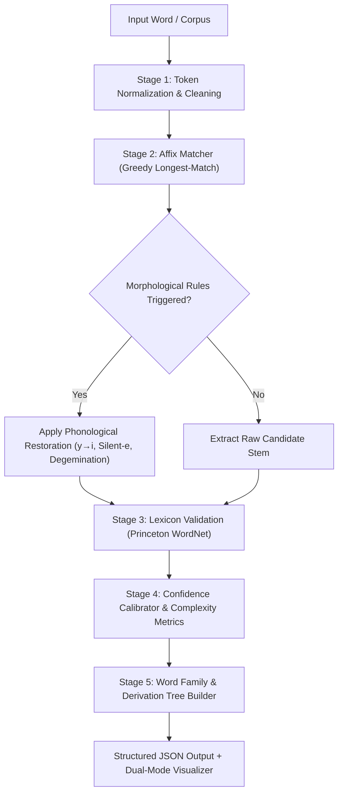

<div align="center">

# 🌿 Affixa
### Rule-Based Morphological Analyzer for Natural Language Processing

[](https://fastapi.tiangolo.com)
[](https://react.dev)
[](https://www.typescriptlang.org/)
[](https://tailwindcss.com)
[](https://supabase.com)
[](https://python.org)
[](LICENSE)

*A deterministic, 100% explainable morphological decomposition engine combining greedy longest-match affix stripping, morphophonological spelling restoration, and Princeton WordNet lexical validation.*

[Key Features](#-key-features) • [System Architecture](#-system-architecture) • [Benchmark Matrix](#-nlp-model-benchmark) • [Quick Start](#-quick-start) • [API Documentation](#-api-reference) • [Author](#-author--maintainer)

---

</div>

## 📌 Executive Summary

Modern deep-learning tokenizers (e.g., WordPiece, Byte-Pair Encoding, SentencePiece) prioritize statistical subword frequency counts over authentic grammatical morphology. Consequently, they obscure linguistic boundaries, invent unnatural sub-tokens, and operate as black boxes without explainability.

**Affixa** solves this by providing a **transparent, rule-based computational linguistics engine** that:
1. Deconstructs complex English words into exact **Prefix**, **Base Root Lemma**, and **Suffix** constituents.
2. Identifies and executes the exact **Morphophonological Transformation Rule** applied ($y \to i$ alternation, silent-*e* insertion, geminate consonant reduction, $t$-restoration for `-tion`).
3. Cross-validates candidate stems against **Princeton WordNet** to eliminate pseudo-roots with zero hallucinations.
4. Generates a **Hierarchical Derivation Tree**, calculates derivational depth, and reveals the complete **Morphological Word Family**.

---

## ✨ Key Features

| Feature | Description |
| :--- | :--- |
| 🌲 **Forest Green Design System** | Minimal, modern AI-product interface built with dark/light mode toggle and adaptive styling (`#051F20`, `#0B2B26`, `#163832`, `#235347`, `#8EB69B`, `#DAF1DE`). |
| ⌨️ **`Cmd+K` / `Ctrl+K` Spotlight** | Global keyboard-driven Command Palette for instant navigation, dictionary searching, and inline word decomposition. |
| 🌳 **Dual-Mode Visualizer** | Toggle between **Morpheme Blocks** view with etymological badges (Greek/Latin/Germanic) and **Hierarchical Derivation Tree** structure. |
| 🧬 **Word Family Generator** | Interactive morphological family explorer showing all valid prefixed, suffixed, and compound variants derived from the base root. |
| 🎯 **Longest-Match Decomposition** | Greedy prefix/suffix stripping from a curated lexicon of 200+ linguistic affixes, eliminating partial boundary misses. |
| 🔄 **12 Morphophonological Rules** | Automatic phonological spelling restoration: $y \to i$, silent-*e* recovery, consonant degemination, $t$-restoration for `-tion`, etc. |
| 🛡️ **WordNet Lexicon Validation** | Rejects non-lexical stems and validates base forms against Princeton WordNet synsets. |
| 📊 **Calibrated Confidence Scoring** | Explainable, rule-derived confidence scoring ($0.0 \to 1.0$) based on affix legitimacy and lexical verification. |
| 📑 **High-Throughput Batch Processor** | Upload `.txt` or `.csv` files or click 1-click sample corpus loaders to analyze bulk text with real-time CSV export. |
| 🔬 **4-Way Benchmark Matrix** | Direct head-to-head comparison of Rule-Based decomposition vs. Porter Stemmer, Snowball Stemmer, and spaCy Lemmatizer. |
| 💻 **Developer API Playground** | Interactive REST API tester with copyable cURL, Python (`requests`), and JavaScript (`fetch`) code snippets. |
| 🔒 **Supabase Auth & RLS** | Isolated analysis histories per researcher account secured with Row-Level Security policies. |

---

## 🏛️ System Architecture



### Color-Coded Morphological Segmentation
| Morpheme Type | Color Indicator | Example (`unhappiness`) | Description |
| :--- | :--- | :--- | :--- |
| **Prefix** | Warm Gold (`#e2b857`) | `[un-]` | Derivational / Inflectional prefix modifier |
| **Root** | Sage Green (`#8EB69B`) | `happy` | Validated dictionary base lemma |
| **Suffix** | Soft Teal (`#7ec8c8`) | `[-ness]` | Nominalizing / Derivational category suffix |

---

## 🔬 NLP Model Benchmark

How Affixa compares against conventional stemmers and lemmatizers:

| Target Word | Affixa Rule-Based (Our Approach) | Porter Stemmer | Snowball Stemmer | spaCy Lemmatizer | Affixa Advantage |
| :--- | :--- | :--- | :--- | :--- | :--- |
| `unhappiness` | `[un-] + happy + [-ness]` | `unhappi` | `unhappi` | `unhappiness` | Complete 3-way split + restored authentic lemma `happy` |
| `international` | `[inter-] + nation + [-al]` | `intern` | `intern` | `international` | Isolates prefix `inter-` without mutilating stem |
| `disconnection` | `[dis-] + connect + [-tion]` | `disconnect` | `disconnect` | `disconnection` | Recovers both `dis-` prefix and `-tion` suffix |
| `rewriting` | `[re-] + write + [-ing]` | `rewrit` | `rewrit` | `rewrite` | Restores silent-*e* on base verb `write` |
| `beautiful` | `beauty + [-ful]` | `beauti` | `beauti` | `beautiful` | Converts `i` back to authentic base `beauty` |
| `preprocessing` | `[pre-] + process + [-ing]` | `preprocess` | `preprocess` | `preprocessing` | Dual prefix-suffix extraction |
| `undeniable` | `[un-] + deny + [-able]` | `undeni` | `undeni` | `undeniable` | Handles $y \to i$ restoration and `-able` suffix |

---

## 🚀 Quick Start

### Prerequisites
- **Python**: 3.10+
- **Node.js**: 18.0+
- **Git**

### 1. Clone the Repository
```bash
git clone https://github.com/Damini2006/Affixa.git
cd Affixa
```

### 2. Backend Setup
```bash
# Navigate to backend directory
cd backend

# Create and activate virtual environment
python -m venv venv

# On Windows (PowerShell):
.\venv\Scripts\Activate.ps1
# On macOS/Linux:
source venv/bin/activate

# Install dependencies
pip install -r requirements.txt

# Start FastAPI development server
python run.py
```
> The backend server starts at **`http://localhost:8000`** (API docs available at `http://localhost:8000/docs`).

### 3. Frontend Setup
```bash
# In a new terminal, navigate to frontend directory
cd frontend

# Install dependencies
npm install

# Start Vite development server
npm run dev
```
> The frontend application starts at **`http://localhost:5173`**.

---

## 📡 API Reference

### 1. Analyze Single Word
`POST /api/analyze/word`

**Request Body:**
```json
{
  "word": "unhappiness"
}
```

**Response (200 OK):**
```json
{
  "word": "unhappiness",
  "prefix": "un",
  "root": "happy",
  "suffix": "ness",
  "method": "rule-based",
  "rule": "y -> i restoration",
  "confidence": 0.97,
  "is_valid": true,
  "derivation_depth": 2,
  "morphemes": [
    { "text": "un", "type": "prefix", "origin": "Germanic" },
    { "text": "happy", "type": "root", "origin": "Old Norse" },
    { "text": "ness", "type": "suffix", "origin": "Germanic" }
  ]
}
```

---

### 2. Compare Across 4 NLP Models
`POST /api/compare/word`

**Request Body:**
```json
{
  "word": "disconnection"
}
```

**Response (200 OK):**
```json
{
  "word": "disconnection",
  "rule_based": {
    "prefix": "dis",
    "root": "connect",
    "suffix": "tion",
    "rule": "t-restoration for -tion",
    "confidence": 0.94
  },
  "porter": "disconnect",
  "snowball": "disconnect",
  "spacy": "disconnection"
}
```

---

### 3. Batch Corpus Analysis
`POST /api/analyze/text`

**Request Body:**
```json
{
  "text": "international preprocessing rewriting"
}
```

**Response (200 OK):**
```json
[
  { "word": "international", "prefix": "inter", "root": "nation", "suffix": "al", "confidence": 0.91, "is_valid": true },
  { "word": "preprocessing", "prefix": "pre", "root": "process", "suffix": "ing", "confidence": 0.93, "is_valid": true },
  { "word": "rewriting", "prefix": "re", "root": "write", "suffix": "ing", "confidence": 0.96, "is_valid": true }
]
```

---

## 📁 Repository Structure

```
Affixa/
├── backend/
│   ├── app/
│   │   ├── api/
│   │   │   └── endpoints.py         # FastAPI REST router & API handlers
│   │   ├── nlp/
│   │   │   ├── analyzer.py          # Core morphological orchestrator
│   │   │   ├── affix_matcher.py     # Longest-match greedy algorithm
│   │   │   ├── spelling_rules.py    # 12 morphophonological transformation rules
│   │   │   ├── confidence.py        # Rule-based score calibration
│   │   │   ├── validator.py         # Princeton WordNet synset verification
│   │   │   └── dictionaries/
│   │   │       ├── prefixes.json    # Curated prefix lexicon
│   │   │       └── suffixes.json    # Curated suffix lexicon
│   │   └── main.py                  # App initialization & CORS configuration
│   ├── requirements.txt             # Python dependencies
│   └── run.py                       # Uvicorn server runner
│
├── frontend/
│   ├── src/
│   │   ├── components/
│   │   │   ├── AppLayout.tsx        # Dashboard layout with collapsible sidebar
│   │   │   ├── CommandPalette.tsx   # Global Cmd+K Spotlight modal
│   │   │   ├── DecompositionVisualizer.tsx # Morpheme Blocks & Tree Visualizer
│   │   │   ├── NavBar.tsx           # Public navigation bar with live status
│   │   │   └── ProtectedRoute.tsx   # Supabase authentication guard
│   │   ├── context/
│   │   │   ├── AuthContext.tsx      # Supabase authentication provider
│   │   │   └── ThemeContext.tsx     # Dark / Light theme provider
│   │   ├── pages/
│   │   │   ├── Landing.tsx          # Hero, live demo, pipeline, capabilities & FAQ
│   │   │   ├── Analyzer.tsx         # Word analyzer, AI insights & Word Family
│   │   │   ├── Batch.tsx            # Corpus file upload & CSV exporter
│   │   │   ├── Comparison.tsx       # 4-way NLP benchmark matrix
│   │   │   ├── Analytics.tsx        # Dynamic metrics & Recharts visualization
│   │   │   ├── Dictionary.tsx       # Searchable 200+ affix reference
│   │   │   ├── Settings.tsx         # User profile, engine tuning & API Playground
│   │   │   ├── NotFound.tsx         # 404 error page
│   │   │   └── auth/
│   │   │       ├── Login.tsx        # Split-screen login
│   │   │       └── Register.tsx     # Split-screen registration
│   │   ├── services/
│   │   │   └── api.ts               # Axios API client
│   │   └── index.css                # Forest Green design system variables
│   ├── package.json
│   └── vite.config.ts
│
└── README.md
```

---

## 👩‍💻 Author & Maintainer

**Neelam Rishika Damini**  
GitHub: [@Damini2006](https://github.com/Damini2006)  
Email: [neelamrishikadamini@gmail.com](mailto:neelamrishikadamini@gmail.com)  
Repository: [https://github.com/Damini2006/Affixa](https://github.com/Damini2006/Affixa)

---

## 📜 License

This project is open source and available under the [MIT License](LICENSE).
