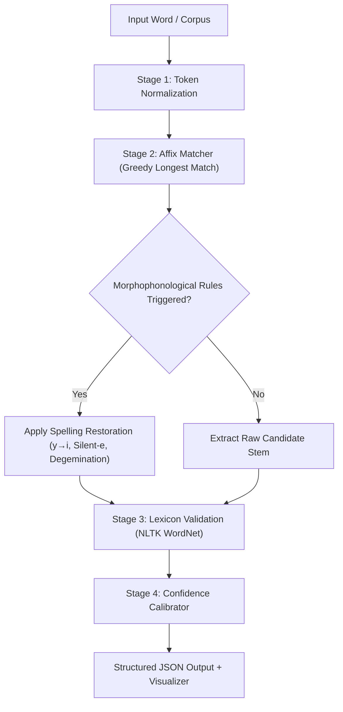

<div align="center">

# 🌿 Affixa
### Rule-Based Morphological Analyzer for Natural Language Processing

[](https://fastapi.tiangolo.com)
[](https://react.dev)
[](https://www.typescriptlang.org/)
[](https://tailwindcss.com)
[](https://supabase.com)
[](https://python.org)
[](LICENSE)

*A deterministic, 100% explainable morphological decomposition engine combining greedy longest-match affix stripping, morphophonological spelling restoration, and Princeton WordNet lexical validation.*

[Live Demo](#) · [Key Features](#-key-features) · [Architecture](#-system-architecture) · [Benchmark Matrix](#-nlp-model-benchmark) · [Quick Start](#-quick-start) · [API Documentation](#-api-reference)

---

</div>

## 📌 Executive Summary

Modern deep-learning tokenizers (e.g., WordPiece, Byte-Pair Encoding) optimize for subword frequency counts rather than grammatical morphology. As a consequence, they obscure true linguistic boundaries and lack interpretability.

**Affixa** resolves this challenge by providing a **transparent, rule-based computational linguistics engine** that breaks complex English words into their exact **Prefix**, **Base Root Lemma**, and **Suffix** constituents, traces the exact phonological rule applied (e.g., $y \to i$ alternation, silent-*e* deletion, consonant degemination), and cross-validates against lexical databases with zero hallucinations.

---

## ✨ Key Features

- 🌲 **Forest Green Design System**: Minimal, focused, AI-product UI built with modern aesthetics, dark/light mode toggle, and smooth micro-interactions.
- 🎯 **Longest-Match Decomposition**: Prioritizes longest matching affixes first from a curated lexicon of 200+ prefixes and suffixes to eliminate false partial stripping.
- 🔄 **12 Morphophonological Rules**: Reconstructs underlying root forms via automatic spelling restoration rules ($y \to i$, silent-$e$ insertion, geminate consonant reduction, $t$-restoration for `-tion`).
- 🛡️ **Princeton WordNet Synset Validation**: Cross-verifies candidate roots against NLTK WordNet to reject pseudo-roots and guarantee authentic dictionary lemmas.
- 📊 **Calibrated Confidence Scoring**: Generates explainable, rule-derived confidence percentages based on linguistic constraint fulfillment.
- ⚡ **Sub-10ms Latency**: Executes at in-memory speed without heavyweight GPU requirements.
- 📑 **High-Throughput Batch Processor**: Upload `.txt` or `.csv` corpora to deconstruct thousands of tokens concurrently and export structured CSV datasets.
- 🔬 **Multi-Model Benchmark Matrix**: Side-by-side comparison of Rule-Based decomposition against Porter Stemmer, Snowball Stemmer, and spaCy Lemmatizer.
- 🔒 **Supabase Authentication & Row-Level Security (RLS)**: Isolated analysis histories per researcher account with real-time analytics.

---

## 🏛️ System Architecture



### Color-Coded Morphological Segmentation
| Morpheme Type | Theme Color | Example (`unhappiness`) | Description |
| :--- | :--- | :--- | :--- |
| **Prefix** | Warm Gold (`#e2b857`) | `[un-]` | Derivational / Inflectional prefix |
| **Root** | Sage Green (`#8EB69B`) | `happy` | Validated dictionary base lemma |
| **Suffix** | Soft Teal (`#7ec8c8`) | `[-ness]` | Nominalizing / Derivational suffix |

---

## 🔬 NLP Model Benchmark

How Affixa compares against conventional stemmers and lemmatizers:

| Target Word | Affixa Rule-Based (Our Approach) | Porter Stemmer | Snowball Stemmer | spaCy Lemmatizer | Affixa Advantage |
| :--- | :--- | :--- | :--- | :--- | :--- |
| `unhappiness` | `[un-] + happy + [-ness]` | `unhappi` | `unhappi` | `unhappiness` | Full decomposition + valid lemma `happy` |
| `international` | `[inter-] + nation + [-al]` | `intern` | `intern` | `international` | Isolates prefix `inter-` without mutilating stem |
| `disconnection` | `[dis-] + connect + [-tion]` | `disconnect` | `disconnect` | `disconnection` | Exposes both `dis-` prefix and `-tion` suffix |
| `rewriting` | `[re-] + write + [-ing]` | `rewrit` | `rewrit` | `rewrite` | Restores silent-*e* on base verb `write` |
| `beautiful` | `beauty + [-ful]` | `beauti` | `beauti` | `beautiful` | Converts `i` back to authentic base `beauty` |
| `preprocessing` | `[pre-] + process + [-ing]` | `preprocess` | `preprocess` | `preprocessing` | Dual prefix-suffix extraction |

---

## 🚀 Quick Start

### Prerequisites
- **Python**: 3.10+
- **Node.js**: 18.0+
- **npm** or **yarn**

### 1. Backend Setup

```bash
# Navigate to backend directory
cd backend

# Create and activate virtual environment
python -m venv venv
# On Windows:
.\venv\Scripts\activate
# On macOS/Linux:
source venv/bin/activate

# Install dependencies
pip install -r requirements.txt

# Start FastAPI development server (runs on http://localhost:8000)
python run.py
```

### 2. Frontend Setup

```bash
# Navigate to frontend directory
cd frontend

# Install npm dependencies
npm install

# (Optional) Create .env for Supabase Authentication
# VITE_SUPABASE_URL=your_supabase_project_url
# VITE_SUPABASE_ANON_KEY=your_supabase_anon_key
# VITE_API_URL=http://localhost:8000/api

# Start Vite development server (runs on http://localhost:5173)
npm run dev
```

---

## 📡 API Reference

### 1. Analyze Single Word
`POST /api/analyze/word`

**Request Body:**
```json
{
  "word": "unhappiness"
}
```

**Response (200 OK):**
```json
{
  "word": "unhappiness",
  "prefix": "un",
  "root": "happy",
  "suffix": "ness",
  "method": "rule-based",
  "rule": "y -> i restoration",
  "confidence": 0.97,
  "is_valid": true
}
```

---

### 2. Compare Across 4 NLP Models
`POST /api/compare/word`

**Request Body:**
```json
{
  "word": "disconnection"
}
```

**Response (200 OK):**
```json
{
  "word": "disconnection",
  "rule_based": {
    "prefix": "dis",
    "root": "connect",
    "suffix": "tion",
    "rule": "t-restoration for -tion",
    "confidence": 0.94
  },
  "porter": "disconnect",
  "snowball": "disconnect",
  "spacy": "disconnection"
}
```

---

### 3. Batch Corpus Analysis
`POST /api/analyze/text`

**Request Body:**
```json
{
  "text": "international preprocessing rewriting"
}
```

**Response (200 OK):**
```json
[
  { "word": "international", "prefix": "inter", "root": "nation", "suffix": "al", "confidence": 0.91, "is_valid": true },
  { "word": "preprocessing", "prefix": "pre", "root": "process", "suffix": "ing", "confidence": 0.93, "is_valid": true },
  { "word": "rewriting", "prefix": "re", "root": "write", "suffix": "ing", "confidence": 0.96, "is_valid": true }
]
```

---

## 📁 Repository Structure

```
Affixa/
├── backend/
│   ├── app/
│   │   ├── api/
│   │   │   └── endpoints.py         # FastAPI REST router
│   │   ├── nlp/
│   │   │   ├── analyzer.py          # Core morphological analysis orchestrator
│   │   │   ├── affix_matcher.py     # Longest-match greedy algorithm
│   │   │   ├── spelling_rules.py    # 12 morphophonological transformation rules
│   │   │   ├── confidence.py        # Rule-based score calibration
│   │   │   ├── validator.py         # NLTK WordNet lexicon verification
│   │   │   └── dictionaries/
│   │   │       ├── prefixes.json    # Curated prefix lexicon
│   │   │       └── suffixes.json    # Curated suffix lexicon
│   │   └── main.py                  # App initialization & CORS middleware
│   ├── requirements.txt             # Python dependencies
│   └── run.py                       # Server runner
│
├── frontend/
│   ├── src/
│   │   ├── components/
│   │   │   ├── AppLayout.tsx        # Dashboard layout with collapsible sidebar
│   │   │   ├── NavBar.tsx           # Public header with engine status
│   │   │   ├── ProtectedRoute.tsx   # Auth guard
│   │   │   └── DecompositionVisualizer.tsx # Morpheme breakdown UI
│   │   ├── context/
│   │   │   ├── AuthContext.tsx      # Supabase auth session provider
│   │   │   └── ThemeContext.tsx     # Dark/Light mode provider
│   │   ├── pages/
│   │   │   ├── Landing.tsx          # Hero, 3-step pipeline, live demo, FAQ
│   │   │   ├── Analyzer.tsx         # Interactive word analysis & AI insights
│   │   │   ├── Batch.tsx            # Corpus file upload & CSV export
│   │   │   ├── Comparison.tsx       # 4-way NLP model benchmark matrix
│   │   │   ├── Analytics.tsx        # Dynamic stats & Recharts visualizer
│   │   │   ├── Dictionary.tsx       # Searchable 200+ affix database
│   │   │   ├── Settings.tsx         # Lexicon tuning & user profile
│   │   │   ├── NotFound.tsx         # 404 error page
│   │   │   └── auth/
│   │   │       ├── Login.tsx        # Split-screen login
│   │   │       └── Register.tsx     # Split-screen registration
│   │   ├── services/
│   │   │   └── api.ts               # Axios API client
│   │   └── index.css                # Forest Green design system variables
│   ├── package.json
│   └── vite.config.ts
│
└── README.md
```

---

## 👩‍💻 Author & Maintainer

**Neelam Rishika Damini**  
GitHub: [@Damini2006](https://github.com/Damini2006)  
Email: [neelamrishikadamini@gmail.com](mailto:neelamrishikadamini@gmail.com)

---

## 📜 License

This project is licensed under the MIT License - see the [LICENSE](LICENSE) file for details.
